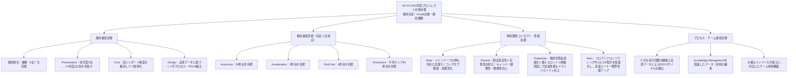
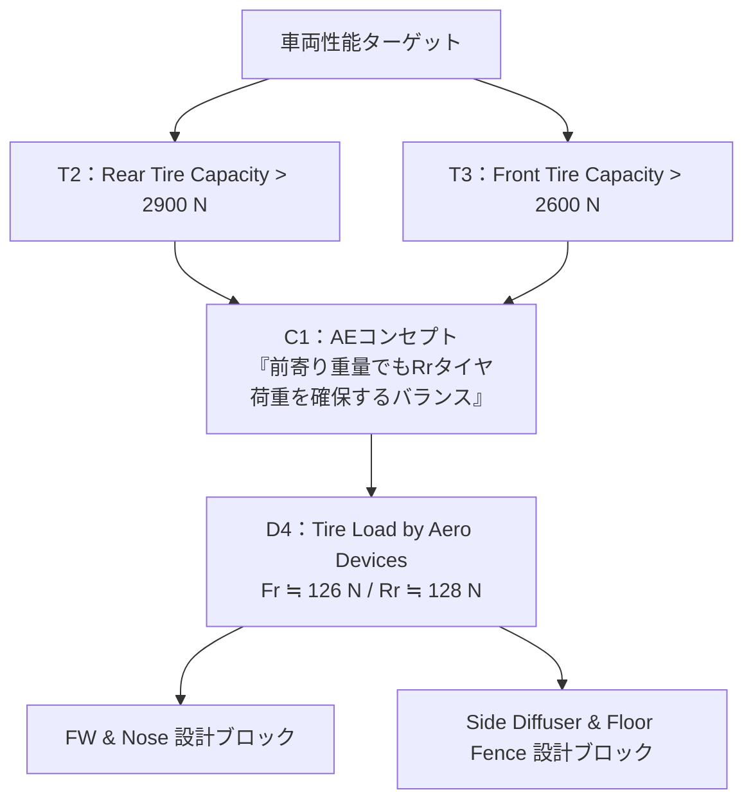
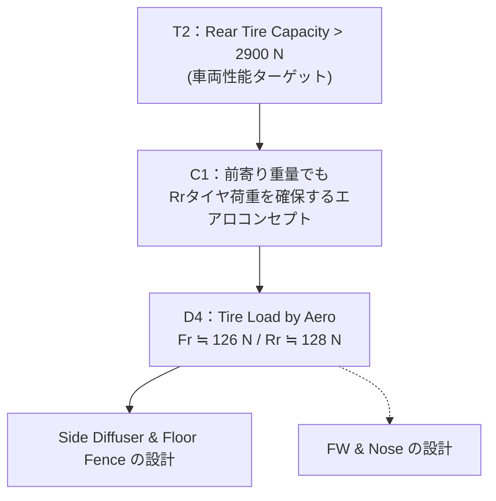

```mermaid
graph TD

    AE["AE：Aero design (OF-23)<br/>– Steady Lateral G 1.5G & Tire Capacity に貢献"]

    %% 1. 車両性能ターゲットとのつながり
    AE --> T0["車両性能ターゲット（上位）"]
    T0 --> T1["Steady Lateral G 1.5 G（目標）"]
    T0 --> T2["Rear Tire Capacity > 2900 N"]
    T0 --> T3["Front Tire Capacity > 2600 N"]
    T0 --> T4["Skidpad 5.0 s を含む FSAEJ Top3 タイム目標"]

    %% 2. AE 全体コンセプト
    AE --> C0["AE 全体コンセプト"]
    C0 --> C1["エンジン前進＆重心シフトに対し<br/>リアタイヤ荷重を確保するエアロバランス"]
    C0 --> C2["Side Diffuser(SD) の有効面積減少で落ちる DF を<br/>FW・Nose・Monocoque をまとめて再設計して補う"]
    C0 --> C3["Total DF を維持しつつ A.B. をやや後ろ寄りに変更"]
    C0 --> C4["限られたリソースの中で製作性も同時に改善"]

    %% 3. AE 数値ターゲット / 結果
    AE --> D0["AE 数値目標・結果（@12.5 m/s）"]
    D0 --> D1["FW DF: 107 → 107.2 N / DG: 16.5 → 15.3 N"]
    D0 --> D2["RW DF: 121.2 → 125.7 N / DG: 48.4 → 48.6 N"]
    D0 --> D3["SD DF: 21.3 → 20.6 N / DG: 6.4 → 5.9 N"]
    D0 --> D4["Tire Load by Aero Devices<br/>Fr 126 N : Rr 128 N ≒ 50:50"]
    D0 --> D5["Aero device mass ≒ 11.4 kg（Mass breakdown より）"]

    %% 4. FW & Nose の設計ロジック
    AE --> FN0["FW & Nose 設計ロジック"]
    FN0 --> FN1["前提：Suspension arm / Muffler で<br/>SD 上面投影面積が減少 → SD DF↓"]
    FN0 --> FN2["High Nose & Low Camber FW で<br/>SD に流す流量を増やす（流入を確保）"]
    FN0 --> FN3["Section A（Monocoque & Nose 上流）<br/>– Low Camber & Long Chord<br/>→ upwash 抑制＋翼面積増で SD への流れを整える"]
    FN0 --> FN4["Section B（タイヤ前）<br/>– 規定の keep-out を守りつつ High Camber<br/>→ Front Tire 近傍の DF 増加"]
    FN0 --> FN5["Section C（A-B 間）<br/>– High Camber & Long Chord<br/>→ 可能な限り DF を稼ぐ"]

    %% 5. Side Diffuser & Floor Fence の設計ロジック
    AE --> SD0["Side Diffuser & Floor Fence 設計ロジック"]
    SD0 --> SD1["課題：Frame / Suspension 制約で<br/>SD の設計領域が縮小 → 従来と同じ DF を出しにくい"]
    SD0 --> SD2["対策1：Inlet & Outlet 角度最適化<br/>– Inlet 5° / Outlet 25° 付近に設定<br/>→ 2D 解析で高 DF & 重量 -9% を両立"]
    SD0 --> SD3["対策2：Floor Fence 1,2 の追加<br/>– フェンスで渦を生成し、<br/>分離を防ぎつつ高エネルギー流を導く"]
    SD0 --> SD4["結果：DF 約 +54% / L/D 約 +52% 向上<br/>(No Fence 比, DG 増加は +1.5 N 程度に抑制)"]
    SD0 --> SD5["対策3：Inverted mould を廃止し下面を極力フラットに<br/>→ 製作工数削減＋下面流速アップ"]

    %% 6. パッケージ・他セクションとの関係
    AE --> P0["パッケージ・他セクションとの関係"]
    P0 --> P1["Body & Monocoque 再設計でエンジン前進・重量前寄り<br/>→ Rr タイヤ荷重が減る方向"]
    P0 --> P2["これを補うために SD / Nose / FW を一体設計し<br/>Aero Balance を Rr 寄りに変更"]
    P0 --> P3["Frame / SU 由来の制約（アーム位置・スペース制限）を<br/>AE 側で吸収しつつ DF を維持"]
    P0 --> P4["翼形状そのものは再利用し、<br/>形状検討リソースを SD・レイアウトに集中"]

    %% 7. リソース・製作性
    AE --> R0["リソース・製作性の工夫"]
    R0 --> R1["翼形状の流用＋型の簡略化で<br/>型製作・成形工数を削減"]
    R0 --> R2["Side 周りの下面形状を単純化し<br/>製作性を上げつつ流速を高める"]
    R0 --> R3["Monocoque / Frame 側の jigs 改善と合わせて<br/>走行距離（試験回数）確保に貢献"]
```

```mermaid
graph TD

    AE["AE：Aero design (OF-23)<br/>– 車両性能ターゲットにどう貢献するかのロジック"]

    %% 1. 車両性能ターゲット（最上流）
    AE --> T0["T0：車両性能ターゲット（上流）"]
    T0 --> T1["Steady Lateral G = 1.5 G"]
    T0 --> T2["Rear Tire Capacity > 2900 N"]
    T0 --> T3["Front Tire Capacity > 2600 N"]
    T0 --> T4["Skidpad 5.0 s / FSAEJ Top3 タイム"]

    %% 2. AEコンセプト（車両目標をAE視点に翻訳）
    T0 --> C0["C0：AE 全体コンセプト"]
    C0 --> C1["エンジン前進・重量前寄りでも Rr Tire 荷重を確保するエアロバランス"]
    C0 --> C2["Side Diffuser 有効面積減少で失われる DF を<br/>FW・Nose・Monocoque をまとめて再設計して補う"]
    C0 --> C3["Total DF を維持しつつ Aero Balance を Rr 寄りに変更"]
    C0 --> C4["限られたリソースの中で製作性も同時に改善"]

    %% 3. AEの数値目標（コンセプトを定量化）
    C0 --> D0["D0：AE 数値目標・制約（@12.5 m/s）"]
    D0 --> D1["FW DF/DG：107.0 N / 15.3 N 程度を維持"]
    D0 --> D2["RW DF/DG：125.7 N / 48.6 N 程度"]
    D0 --> D3["SD DF/DG：20.6 N / 5.9 N 程度"]
    D0 --> D4["Tire Load by Aero：Fr ≒ 126 N / Rr ≒ 128 N（≈50:50）"]
    D0 --> D5["Aero device mass ≒ 11.4 kg 以内"]

    %% 4. 数値目標を達成するための設計ブロック（手段）
    D0 --> FN0["FN0：FW & Nose ブロック"]
    FN0 --> FN1["課題：SU/Frame/Muffler配置で SD 上の空間が減り DF↓"]
    FN0 --> FN2["High Nose & Low Camber 主翼で<br/>SD へ流入する流量を確保"]
    FN0 --> FN3["Section A：upwash 抑制＋長い翼弦で SD への流れを整える"]
    FN0 --> FN4["Section B：タイヤ前 High Camber で Fr Tire 周り DF を稼ぐ"]
    FN0 --> FN5["Section C：High Camber & Long Chord で追加 DF を稼ぐ"]

    D0 --> SD0["SD0：Side Diffuser & Floor Fence ブロック"]
    SD0 --> SD1["課題：設計領域縮小で従来と同量の DF を出しにくい"]
    SD0 --> SD2["対策1：Inlet/Outlet 角度最適化（例：In 5° / Out 25°）"]
    SD0 --> SD3["対策2：Floor Fence 1,2 追加で渦を制御し分離を抑制"]
    SD0 --> SD4["対策3：下面形状の簡素化で工数削減＋下面流速アップ"]

    D0 --> P0["P0：パッケージ & 他セクションとの調整ブロック"]
    P0 --> P1["Monocoque/Frame 再設計でエンジン前進・重量前寄り"]
    P0 --> P2["その影響を AE 側で吸収し<br/>Aero Balance を Rr 寄りになるよう FW/RW/SD を再配置"]
    P0 --> P3["SU 由来のアーム位置・スペース制約を満たしつつ流路を確保"]

    D0 --> R0["R0：実現した性能・評価（結果）"]
    R0 --> R1["CFD上の DF/DG・Tire Load は目標範囲内に収束"]
    R0 --> R2["Mass / 製作性の制約を満たしたうえで<br/>Skidpad/Cornering 目標に十分な Tire Capacity を確保"]
    R0 --> R3["一部は走行データで検証／次年度に向けた改善点として整理"]
```

📣 学生フォーミュラ設計ロジックWSのお知らせ

車両コンセプト〜各パート設計までを “因果ロジック” でつなぎ、
デザインシートを体系化するためのワークショップを行います。

14:00–18:00「デザインシート構造化ワークショップ」

14:00–14:15　Step0：趣旨説明
14:15–14:45　Step1：幹づくり（全体共通）
14:45–15:00　休憩・パート分け
15:00–16:00　Step2：パート別・骨格ツリー作成
16:00–16:45　Step3：パート内編み目づくり
16:45–17:00　休憩
17:00–17:30　Step4：全パート統合
17:30–17:55　Step5：弱み抽出
17:55–18:00　Step6：クロージング