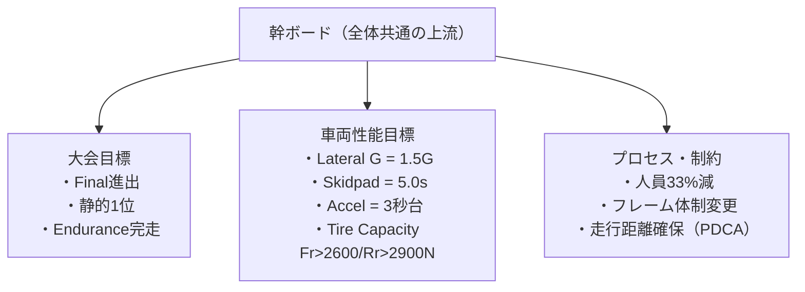
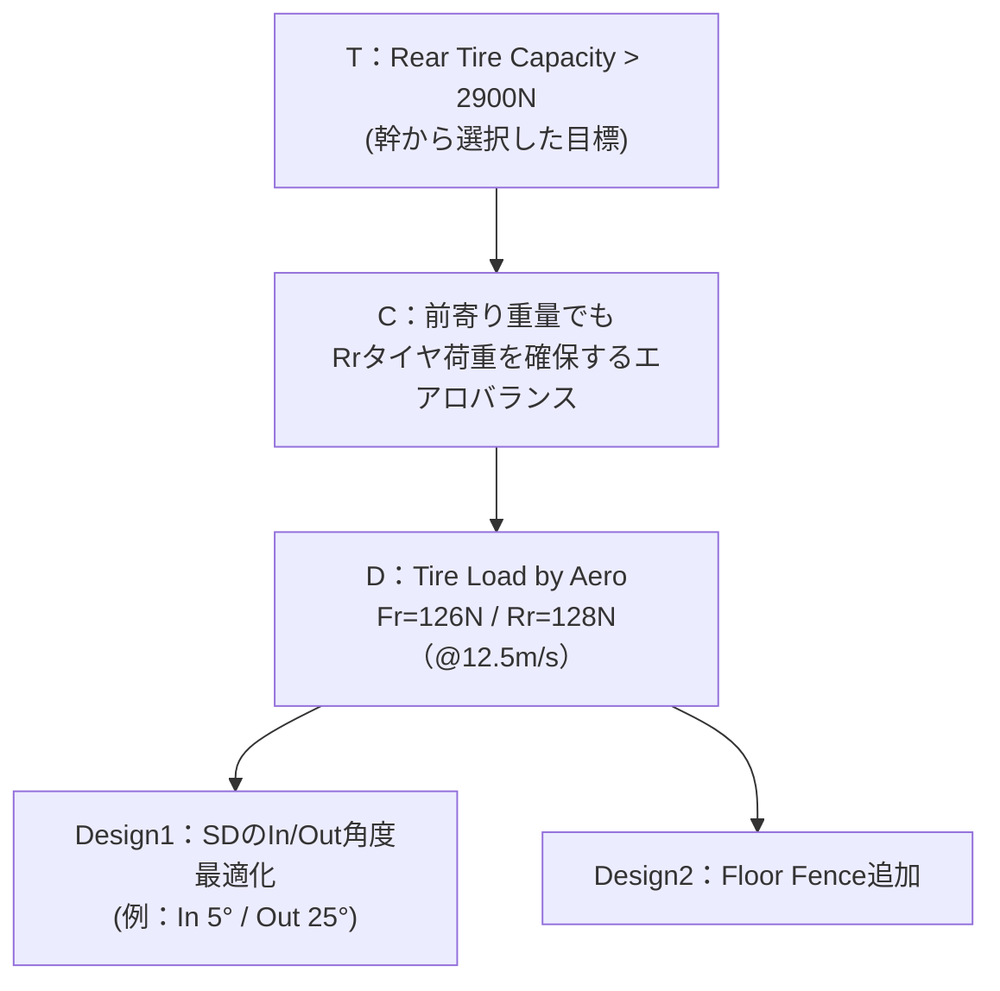
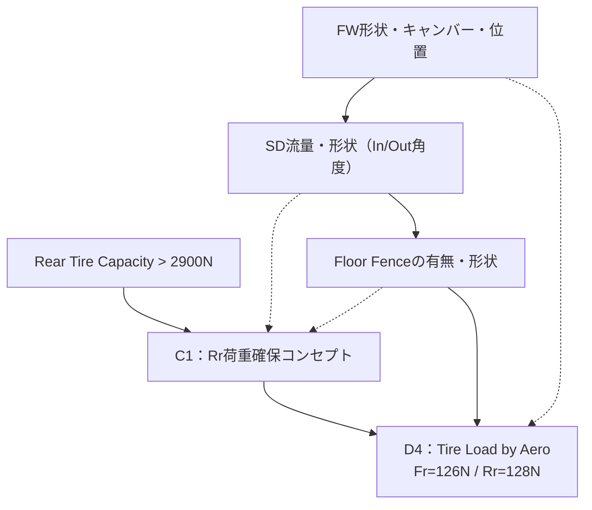
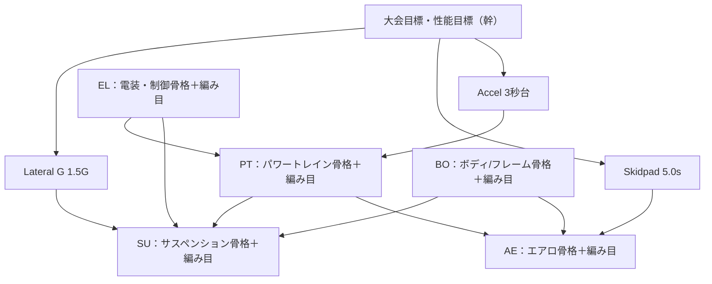

# 学生フォーミュラ設計ロジックWS（13:00–17:00）
## 当日スケジュール ＋ 成果物例つき（Mermaid版）

## 🎯 目的
- デザインシートのロジック構造を可視化する
- 各パートのロジックの穴（Weak Points）を発見する
- パート思考から「車両全体ロジック」の視点へ移行する

---

# 13:00–13:15｜Step0：趣旨説明（15分）

## 内容
- 今日の４ステップ（幹→骨格→編み目→弱み）の説明
- 付箋の意味（T/C/D/Design/Weak）を共有

## 成果物（例：全体イメージ）

- 幹づくり: 大会目標・性能目標・制約
- パート別の骨格ツリー: T→C→D→Design
- パート内の編み目づくり: 因果ネットワーク化
- 弱み抽出: 繋がらない・説明できない部分の発見


---

# 13:15–13:45｜Step1：幹（全体共通）づくり（30分）

## 内容
- 大会目標
- 動的審査の数値目標（Lateral G, Skidpad, Accel, Tire Capacity など）
- プロセス・制約（走行距離、人員、製作性）

## 成果物（例：幹ボード）



---

# 13:45–14:00｜休憩・パート分け（15分）

- 各パートは幹から「自分が最も関係するT」を1つ選ぶ

---

# 14:00–15:00｜Step2：パート別「骨格ツリー」作成（60分）

## 内容
- T（幹のターゲット）を起点に
  T → C（コンセプト） → D（数値目標） → Design（手段）
  の“縦1本ロジック”を作る。

## 成果物（例：AEパートの骨格）



---

# 15:00–15:45｜Step3：パート内「編み目」づくり（45分）

## 内容
- Step2で作った骨格の周りに、余った要素を横方向につなぎ
  パート内の「因果ネットワーク（編み目）」を作る。

## 成果物（例：AEパート編み目）



---

# 15:45–16:00｜休憩（15分）

---

# 16:00–16:30｜Step4：全パート合体・幹への結合（30分）

## 内容
- 各パートの「骨格＋編み目ツリー」を幹ボードに結合。
- パート間の横矢印（AE→SU、PT→AE など）も追加し、
  車両全体のロジックネットワークを作る。

## 成果物（例：全体統合マップ）



---

# 16:30–16:55｜Step5：弱み抽出・議論（25分）

## 内容
- 繋がらない要素
- 意味が説明できない矢印
- 中間ノードが抜けて“飛んでいる”ロジック
- 数値目標が曖昧な部分
- パート間で矛盾している部分

を **Weak Point** として付箋でマークする。

## 成果物（例：Weak Pointマップ）

```
graph TD
  W["Weak Points（ロジックの弱み）"]

  W_AE["AE：<br/>・SD縮小の影響量が数値化されていない<br/>・Fr/Rr荷重50:50の理由が示されていない"]
  W_SU["SU：<br/>・RC変化がどの性能目標に効くか曖昧<br/>・Track/WBの理由がコンセプトと不整合"]
  W_PT["PT：<br/>・スロットル応答遅れがAccelにどう効くか因果不足"]
  W_BO["BO：<br/>・剛性設計の目標値（数値）がない"]

  W --> W_AE
  W --> W_SU
  W --> W_PT
  W --> W_BO
```

---

# 16:55–17:00｜Step6：クロージング（5分）

## 成果物
```
graph TD
  C["WSの成果"]

  C --> O1["巨大ロジックツリー（全体統合マップ）"]
  C --> O2["各パートの骨格ツリー（T→C→D→Design）"]
  C --> O3["Weak Pointリスト（来年度改善ToDo）"]
  C --> O4["車両全体ロジック視点の獲得"]
```

---

# 🌟 このワークショップで得られるもの

```
graph TD
  R["得られるもの"]

  R --> R1["車両全体ロジック視点"]
  R --> R2["デザインシートの“穴”発見力"]
  R --> R3["OBとの因果ベースの議論スキル"]
  R --> R4["来年度静的審査の説明力強化"]
```
